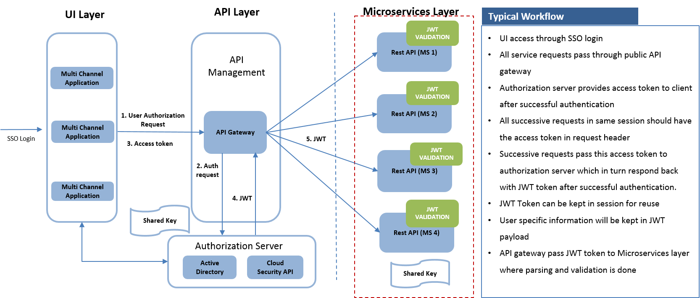

#### Security Module

##### Security module provides helper classes for parsing JWT tokens and authorizing a user.

A typical workflow contains a user authentication with a user name and password.

On a successful user authentication, the auth server sends a JSON Web Token (JWT) to the browser. All further requests come with an HTTP header that contains this 
JWT token in the form of Authorization: xxxxx.yyyyy.zzzzz.

The JWT is passed for service-to-service communication so the services can apply authorization.

This framework module provides helper classes to parse the JWT and authorize a user.



#### Details about module classes:
* A custom authentication filter (JsonWebTokenAuthenticationFilter) that reads the request header if it is present by extending Spring authentication filter RequestHeaderAuthenticationFilter.
* Authentication provider (JsonWebTokenAuthenticationProvider) that reads this token, authenticates it, and converts it to our own custom Authentication object.
* A Security configuration class (JsonWebTokenSecurityConfig)

#### Usage
The secured-accounts-service example demonstrates using security module.

Secure a Microservice by adding a configuration class which extends security module JsonWebTokenSecurityConfig.
```
@Configuration@EnableWebSecurity@EnableGlobalMethodSecurity(prePostEnabled = true)@ComponentScan(basePackages = "com.cts.bfs.microservices.security.*")
public class AccountsWebSecurityConfig extends JsonWebTokenSecurityConfig {

```

